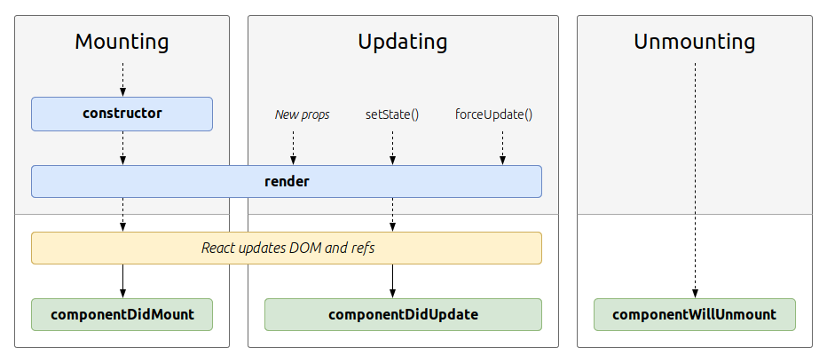

# Životni ciklus komponente

Kada imamo mnogo komponenti koje se menjaju, održavanje sistema postaje teško. **React uvodi faze „životnog ciklusa“ komponente, i obezbeđuje metode za upravljanje svakom fazom.**

Razumevanje životnog ciklusa nam omogućuje da obavimo određene radnje kada se komponenta kreira ili uništava, da odlučimo da li komponenta treba da se ažurira, i reagujemo na promene ulaza (`props`) i stanja.

## Faze životnog ciklusa

### render

Metod `render` se inicijalno izvršava odmah nakon konstruktora komponente. Unutar ovog metoda vraćamo komponentu koja se prikazuje. 

### componentDidMount

Čim se metod `render` završi, biće pozvan metod `componentDidMount`. U ovoj fazi možemo pristupiti DOM-u, i preporučuje se da unutar ovog metoda obavimo sve DOM interakcije.

### shouldComponentUpdate

Svaki put kad se stanje komponente promeni, poziva se nekoliko metoda. Metod `shouldComponentUpdate` se poziva pre `render`-a, i omogućuje da odlučimo treba li ažurirati prikaz komponente. `shouldComponentUpdate` se ne poziva tokom početnog prikazivanja. 

Ako iz ovog metoda vratimo vrednost `true`, komponenta će se ažurirati, ako vratimo `false`, neće. 

### componentDidUpdate

Metod `componentDidUpdate` se poziva nakon što se izvrši metod `render`.

### componentWillUnmount

Kada je komponenta uklonjena iz DOM-a, poziva se metod `componentWillUnmount`. Ovo je pravo mesto za sakupljanje smeća (uklanjanje događaja, čišćenje intervala i slično).
